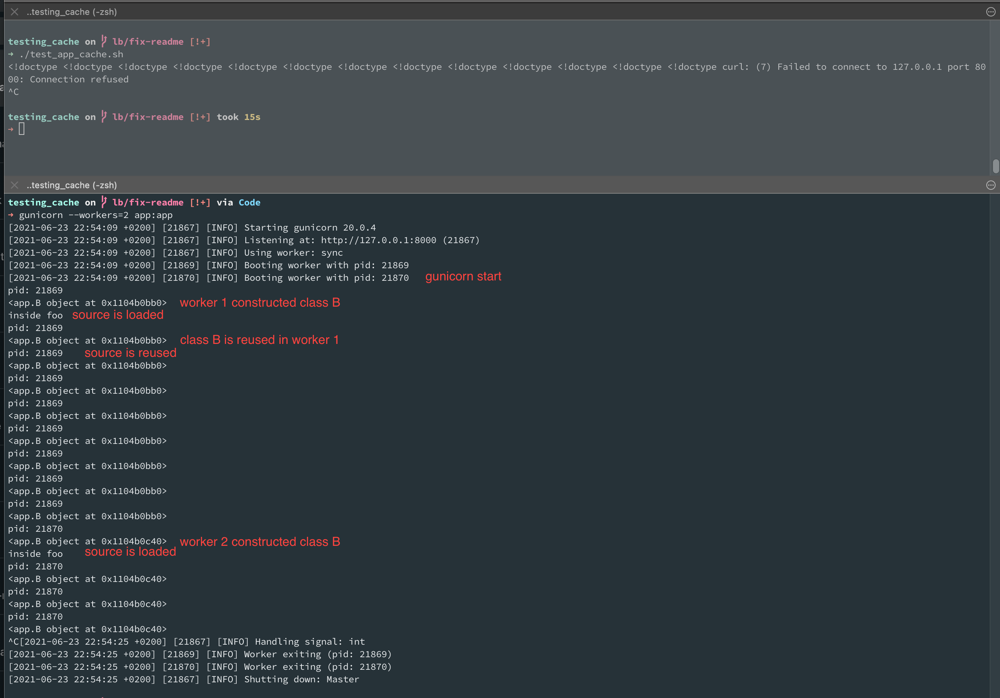
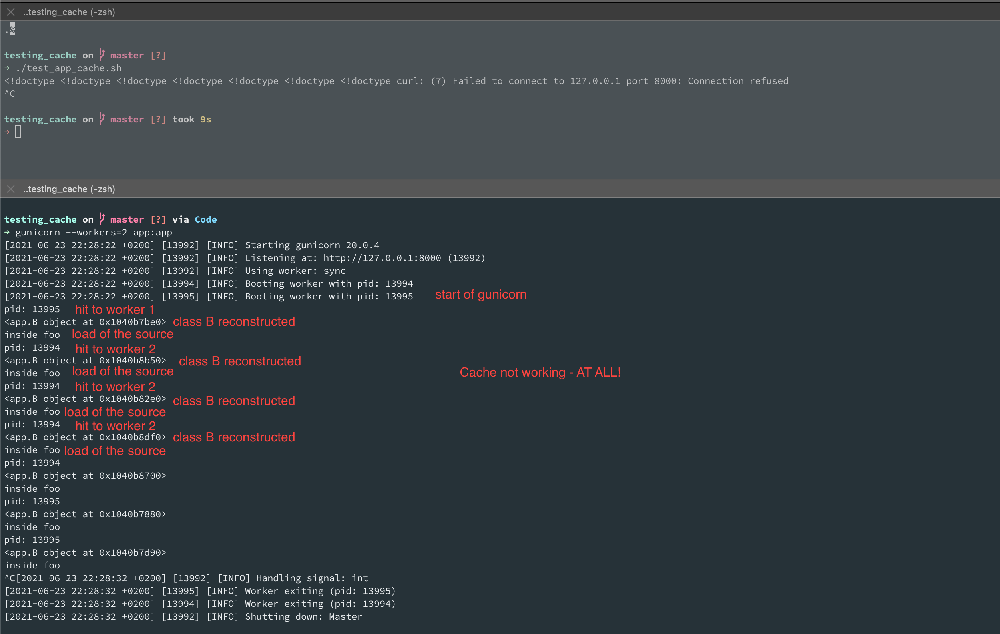
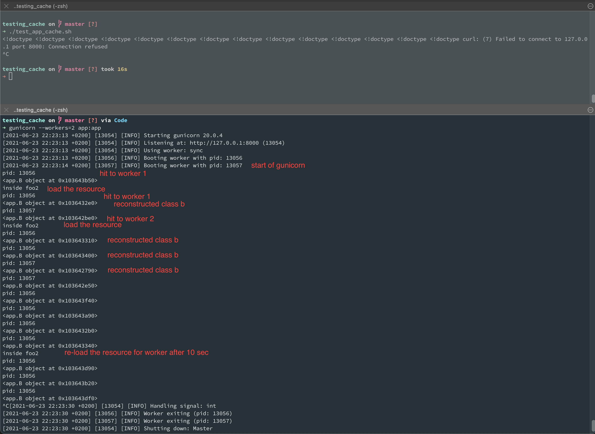

# Testing cache and sharing memory between workers 

start gunicorn

```shell
gunicorn --workers=2 app:app
```

in separate terminal start test

```shell
./test_app_cache.sh
```

## test1: LRU + TTL



Works fine since `class B` is cached by `lru_cache` in gunicorn worker's memory per worker. Therefore `self`
parameter in `foo` is never different which allows the `TTLCache` work correctly.

## test2: no LRU just TTL in class



Since `class B` is constructed and stored for each separate API hit and cache works
based on method parameters from which one is `self` (always different) this solution can
only work when `class B` is constructed at the very same memory space - in order words
*never*

## test3: just TTL in static method



When omitting the `self` in `foo2` by making it a `staticmethod` we got rid of parameter
that have forbid us to cache the IO resource even though `class B` is reconstructed for
each API hit
